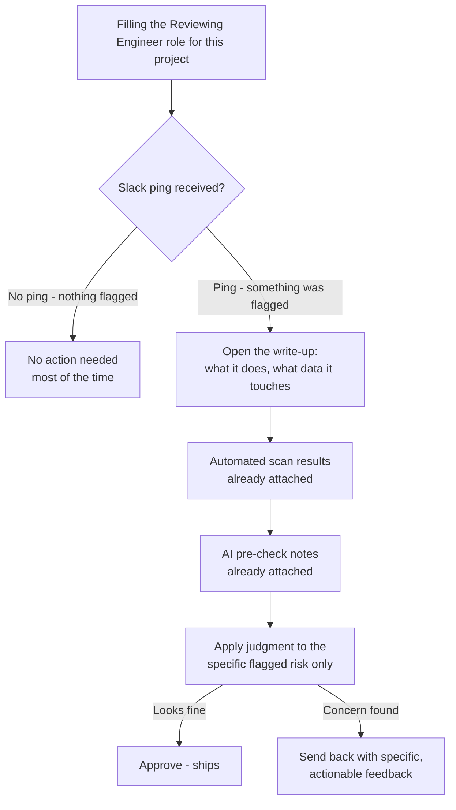

# Citizen-Dev-to-Production Flow — Overview for Product

> **In one line:** Free exploration for AI-coded apps, gated only at the decisions you can't undo.

## Why This Matters

PMs and other non-engineers are now shipping real, working products using AI coding agents. That's a genuine speed win. The problem: some of what gets built touches things that are expensive or risky to unwind later — security, compliance, sensitive data. The goal of what's below is to keep the speed for everyday building, and add a check **only** at the moment something risky is actually at stake — not a review process bolted onto every single thing that gets built.

## Roles at a Glance

| Role | What they do here |
| :--- | :--- |
| **Citizen Developer** | Builds using an AI coding agent |
| **Reviewing Engineer** | Self-fillable — the citizen dev, a technical friend, or explicitly skipped with a logged risk note; engages when something is flagged |
| **Whoever owns this project's technical decisions** | Sets the rules once (what counts as sensitive, what the agent defaults to) — not in either flow below, but accountable for both |

Two separate views follow: what it feels like to build, and what it feels like to review.

---

## 1. The Citizen Developer's Journey

```mermaid
flowchart TD
    A[Start building with AI agent] --> B[Agent already knows our current stack<br/>defaults to compatible tools automatically]
    B --> C[Free, unstructured exploration<br/>no review, no waiting]
    C --> D{Does the work touch<br/>a sensitive area?}
    D -->|No - most of the time| E[Ships to production<br/>no engineer involved]
    D -->|Yes - flagged automatically| F[Quick structured write-up:<br/>what it does, what data it touches]
    F --> G[Automated security scan<br/>runs in the background]
    G --> H[AI pre-check catches<br/>obvious issues first]
    H --> I[Reviewing Engineer (self or otherwise):<br/>~15-30 min review]
    I -->|Approved| E
    I -->|Needs changes| J[Specific, actionable<br/>fix list]
    J --> C
```

**The point:** most building never touches this gate at all. The agent is already steered toward our production-compatible tools by default, so most decisions that would otherwise need a person to weigh in just don't come up.

---

## 2. The Reviewing Engineer's Journey



**The point:** by the time anything reaches a human, two automated layers have already run. The engineer isn't reading code line-by-line — they're making one focused judgment call on one flagged risk, with the groundwork already done.

---

## What's Still Being Worked Out

Being upfront rather than presenting this as more finished than it is:
- The exact list of what counts as a "sensitive area" is still being finalized
- How the system stays current as our production stack evolves is a known open problem, not yet solved

## Feedback Wanted

Does this match how you'd want a PM's shipped work to reach production — and does the "most things need no review at all" balance feel right, or too loose / too strict from where you sit?
